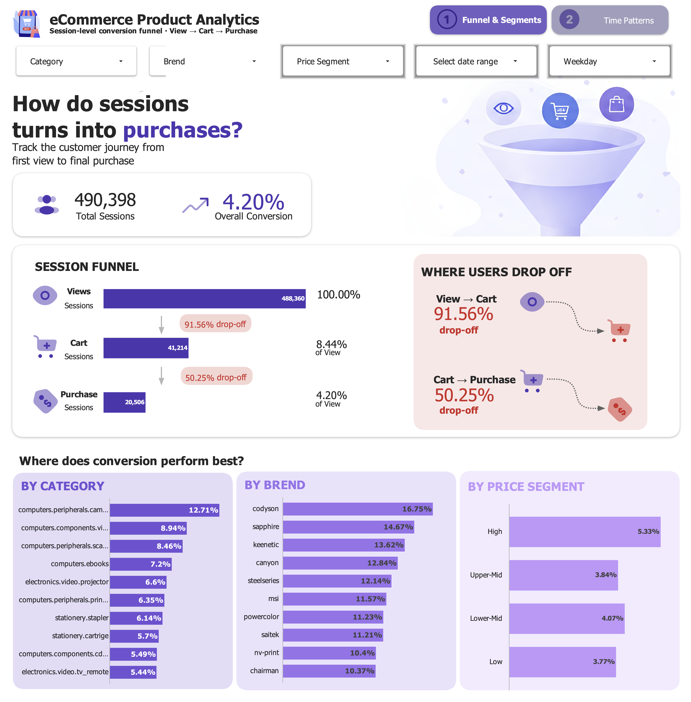
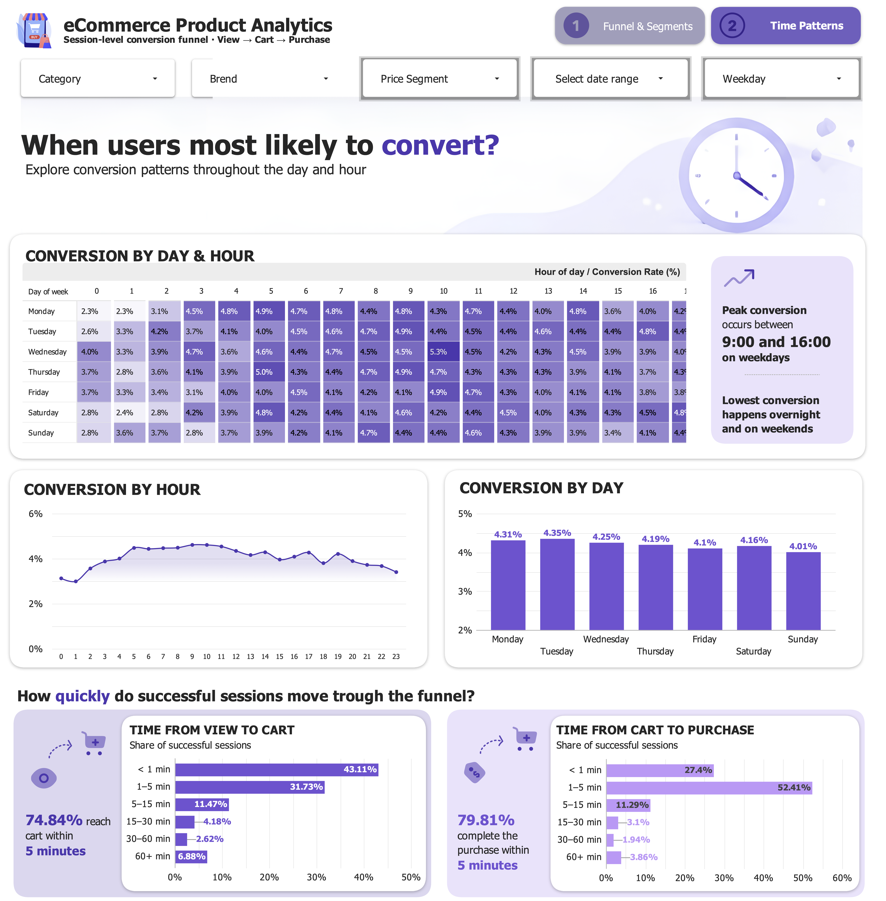

# E-commerce Product Analytics: Conversion Funnel

Session-level product analytics on the [eCommerce Events History in Electronics Store](https://www.kaggle.com/datasets/mkechinov/ecommerce-events-history-in-electronics-store/data) dataset: funnel construction, drop-off analysis, category/brand/price segmentation, time-of-day patterns and time-to-conversion, feeding an interactive Looker dashboard.

## 🔗 Live dashboard

[Looker Dashboard](https://datastudio.google.com/reporting/2274b21e-19d6-4e79-bd61-b1bde99ca362)

### 📊 Dashboard Preview




## 📓 Google Colab Notebooks

[E-commerce Conversion Funnel Analysis](https://colab.research.google.com/drive/1HYg2ZP9z8XuegCBv-Q3bM1WQrzqFS8Ym?usp=sharing)

---

## 📌 Business question

> Where do users drop off in the e-commerce purchase funnel, and which product or behavioral factors are associated with higher conversion?

The dataset does not contain a registration event, so the funnel starts at the first recorded interaction:

**View → Cart → Purchase**

- Primary KPI: Purchase Conversion Rate (View → Purchase)
- Secondary metrics: View → Cart Conversion, Cart → Purchase Conversion, Time to Purchase

---

## 🗂️ Repository structure

```
├── notebooks/
│   └── funnel_notebook.ipynb
│
├── exported_data/
│   └── dashboard_sessions.csv.zip        
│
├── images/                            
│   ├── funnel_segments.png
│   └── time_patterns.png
│
└── README.md
```

---

## 🧱 Data Architecture

```
Kaggle CSV 
      │
      ▼
Google Colab
      ├── Data quality checks 
      ├── Session-level funnel construction (strict View → Cart → Purchase)
      ├── Segment analysis (category, brand, price)
      ├── Time analysis (hour, weekday, day x hour) and time-to-conversion
      │
      └── Session-level table CSV
              │
              ▼ 
      Looker (Funnel & Segments, Time Patterns)
```

---

## 🛠️ Tech stack

- **Python** - Google Colab
- **Looker Studio** - dashboard and data visualization

---

## 📊 Dashboard pages

| Page | Metrics |
| :--- | :--- |
| Funnel & Segments | Total sessions, overall conversion, session funnel (View/Cart/Purchase), drop-off by stage, conversion by category/brand/price segment |
| Time Patterns | Conversion by hour, by weekday, day x hour heatmap, time from View/Cart and Cart/Purchase for successful sessions |

---
## 🔬 Methodology notes

- **Funnel grain**: the funnel is defined at the session level, requiring a strict chronological sequence (view time < cart time < purchase time) within the same `user_session`. Purchases that don't follow this exact sequence are not counted as funnel conversions - so the 4.2% overall rate reflects completion of the predefined funnel sequence.

- **Dashboard segmentation vs. notebook segmentation**: the notebook's category/brand/price analysis assigns a session to every category/brand/price segment its events touch (a session can appear in more than one segment). The dashboard instead assigns each session to a single segment based on the first product viewed in that session, to keep the exported table at a clean one row per session grain that supports cross-filtering. These are both valid but different definitions, and produce slightly different numbers.

## 🔍 Key results

- **The biggest drop-off is View → Cart (91.56%)**, not Cart → Purchase (50.25%) - most of the funnel loss happens before a product is ever added to the cart.

- **Conversion varies more by category/brand than by time of day:** top categories/brands convert 2-3x above the overall average, while weekday conversion only ranges from 4.01% to 4.35%.

- **High-priced products attract more cart adds but convert worse after that:** the High price segment has the strongest View → Cart rate (11.95%) but the weakest Cart → Purchase rate (43.12%) - but still the highest overall conversion (5.15%), suggesting purchase friction rather than lack of interest.

- **Successful sessions move fast:** 74.84% reach the cart within 5 minutes of the first view, and 79.81% complete the purchase within 5 minutes of adding to cart.

---
## ⚠️ Known limitations

- **Entry-point attribution** - category and brand breakdowns in the dashboard are based on the first viewed product in each session. Therefore, they represent the product category and brand users entered the session through, rather than necessarily the category or brand ultimately purchased.

- **Time-to-conversion selection** — View → Cart and Cart → Purchase timing is analyzed only for successfully converted sessions. Therefore, these distributions describe the behavior of successful sessions and cannot be used to estimate the probability of conversion at different time intervals.

- **Segment definitions differ between notebook and dashboard:** category, brand and price segment rankings can shift between the two artifacts - for example, the notebook ranks Low above Upper-Mid in overall conversion, while the dashboard (first-view-only) ranks them the other way around. Both are internally consistent, but not directly comparable number-for-number.

- **The `user_session` field has known limitations:** a small number of session IDs persist for unusually long periods (up to 155 days), suggesting some sessions may not reflect a single continuous visit. This was investigated ('Extreme Users Check' in the notebook) and does not lead to any significant skewing of the results, but it is a factor that requires caution when working with the raw data.

- **The funnel requires a strict event sequence**: a session with a purchase that doesn't follow the exact View → Cart → Purchase order (a repeat purchase without a new cart event) is not counted as a funnel conversion. The reported conversion rate is therefore a conservative, sequence-based measure.

- **No registration event:** "entering the funnel" is defined as the first view event recorded for a session.
